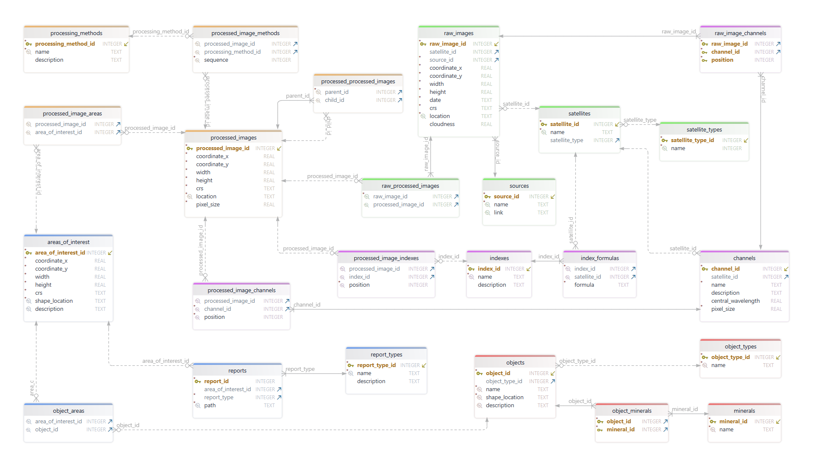

# О проекте

База данных и интерфейс для взаимодейсвтия с ней

# Структура БД

# Описание файлов

- **db.sqlite** - база данных с данными из примера
- **db_clean.sqlite** - пустая база данных
- **db.ipynb** - взаимодействие с БД
- **db_data.ipynb** - добавление данных из примера в БД
- **db_tables.py** - создание файла с названиями таблиц и столбцов БД
- **db_tables.json** - файл с названиями таблиц и столбцов БД
- **scheme.png** - структура БД
- **example** - тестовые данные
- **example/raw** - папка с необработанными спутниковыми снимками
- **example/processed** - папка с обработанными спутниковыми снимками
- **example/shapes** - папка с файлами геометрии объектов и областей интереса
- **example/reports** - папка с отчетами по областям интереса
